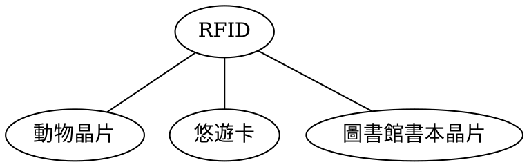

# 2024.03.08

## 1.5.2 行動電話網路

| 代數      | 技術            | 信號類型     |
| --------- | --------------- | ------------ |
| 第一代 1G | AMPS            | 類比 Analogy |
| 第二代 2G | GSM GSM+GPRS | 數位 Digital |
| 第三代 3G | UMTS            | 數位 Digital |
| 第四代 4G | LTE             | 數位 Digital |
| 第五代 5G | UWB             | 數位 Digital |

- ==換手（Handoff）==：A 基地台 ↔ B 基地台，同一公司（系統）
- ==漫遊（Roaming）==：A 系統 ↔ B 系統

## 1.5.4 RFID 與感測網路

==RFID，無線射頻辨識（Radio-frequency identification）==

:::note
二戰時期就出現了
:::

## 1.6.2 國際標準的 重要角色

<table>
  <tr>
    <td>
      
    </td>
    <td>
      <table>
        <tr>
          <th>編號</th>
          <th>筆記</th>
        </tr>
        <tr>
          <td><mark>802.3</mark></td>
          <td>目前有線網路的標準</td>
        </tr>
        <tr>
          <td><mark>802.11</mark></td>
          <td>Wi-Fi，現行最高為Wi-Fi 7.0</td>
        </tr>
        <tr>
          <td><mark>802.15</mark></td>
          <td>❌藍芽，⭕藍牙</td>
        </tr>
        <tr>
          <td><mark>802.16</mark></td>
          <td><a href="https://zh.wikipedia.org/zh-tw/WiMAX">WiMAX</a></td>
        </tr>
      </table>
    </td>
  </tr>
</table>

## 1.7 公制單位

- ==KMGTPEZY==

## 2.1.3 頻道最大資料傳輸率

:::info
有雜訊用 [#Shannon](#shnnon) <code>$2B\cdot log_2V$ bit/second</code>
無雜訊用 [#Nyquist](#nyquist) <code>$B\cdot log_2(1+S/N)$ bit/second</code>
:::

### Nyquist

在==沒有==雜訊的情況下，通道本身頻寬`B` Hz 信號用 `V` 位元編碼的最大傳輸率為

> $2B\cdot log_2V$ bit/second

舉例：

> $B = 10 MHz$
> 信號用 8 bits 編碼，求最大傳輸速率
>
> $B=10\times 10^6(Hz)$ > $V=8$ > $\therefore 2\times 10\times 10^6\times log_28$ > $=2\times 10\times 10^6\times 3$ > $=60\times 10^6(bits/second)$

### Shannon

在==有==雜訊的情況下，通道本身頻寬`B` Hz 信號在 `S/N` 雜訊比中的最大傳輸率為

> $B\cdot log_2(1+S/N)$ bit/second

舉例：

> $B=10MHz$ > $S/N=255$ > $=80,000,000$

### 結論

> Shannon 的結論主要是利用資訊理論的論點推導而出，並且可應用至任何受熱雜訊影響的頻道。讓 ADSL 超過 13 Mbps，必須改進 SNR（例如藉由在線路上靠近用戶處安裝數位中繼器）或使用更多頻寬，如演進至 ADSL2 + 所做的改進。
